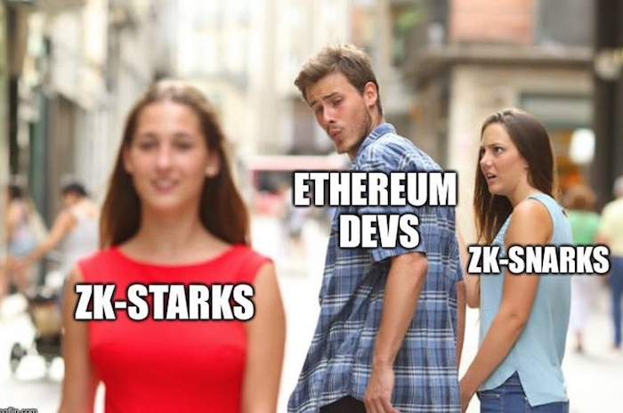

# Zero Knowledge
> The ability to prove honest computation without revealing inputs

|               |   Toxic-waste free    |   Proof time  |   Verify time |   Proof size  |
| ------------- | --------------------- | ------------- | ------------- | ------------- |
|  SNARKs       |           No          |      2.3 s    |       10 ms   |  288 bytes    |
|  STARKs       |           Yes         |      1.6 s    |       16 ms   |  45KB-200KB   |
| Bulletproofs  |           Yes         |      30 s     |     1100 ms   |     1.3KB     |
|  Aurora       |           Yes         |      10 s     |      100 ms   |    100KB      |

> Interesting project idea (*unoriginal*): take the problem as an input and identify the best zero knowledge tool to solve the given problem

- [Elliptic Curve Cryptography](#ECC)
- [Zero Knowledge Proofs General Introduction](#ZKP)
- [zk-SNARKs](#SNARK)
    - [Projects](#SNARK-Projects)
- [zk-STARKs](#STARK)
- [Bulletproofs](#bullet)
    - [Projects](#bullet-projects)
- [Media](#media)

## Elliptic Curve Cryptography 

* [A (Relatively Easy to Understand) Primer on Elliptic Curve Cryptography](https://blog.cloudflare.com/a-relatively-easy-to-understand-primer-on-elliptic-curve-cryptography/) by Nick Sullivan of Cloudflare
* [Introducing Elliptic Curves](https://jeremykun.com/2014/02/08/introducing-elliptic-curves/) by Jeremy Kun
* [Elliptic Curve Cryptography: a gentle introduction](http://andrea.corbellini.name/2015/05/17/elliptic-curve-cryptography-a-gentle-introduction/) by Andrea Corbellini
* [PBC Notes](https://crypto.stanford.edu/pbc/notes/ep/)

## ZKP General Introduction 

* [Zero Knowledge Proofs: An Illustrated Primer](https://blog.cryptographyengineering.com/2014/11/27/zero-knowledge-proofs-illustrated-primer/) by Matthew Green
* [Demystifying Zero-Knowledge Proofs: Devcon 4 Presentation](https://docs.google.com/presentation/d/1gfB6WZMvM9mmDKofFibIgsyYShdf0RV_Y8TLz3k1Ls0/edit#slide=id.p) by Beanstalk

**Hands-On Tutorial by Shir Peled (from StarkWare)**
* [Part 1](http://www.shirpeled.com/2018/09/a-hands-on-tutorial-for-zero-knowledge.html)
* [Part 2](http://www.shirpeled.com/2018/10/a-hands-on-tutorial-for-zero-knowledge.html)
* [Part 3](http://www.shirpeled.com/2018/10/a-hands-on-tutorial-for-zero-knowledge_2.html)
* [Part 4](http://www.shirpeled.com/2018/10/a-hands-on-tutorial-for-zero-knowledge_4.html)

## SNARKs 

* [zkSNARKs in a nutshell](https://blog.ethereum.org/2016/12/05/zksnarks-in-a-nutshell/) by Christian Reitweissner
* [SNARGs](https://gist.github.com/Haseeb-Qureshi/f552fdbbb649ed4bbfeb681beb4091e1) by Alessandro Chiesa
* [Introduction to zk-SNARKs](https://blog.decentriq.ch/zk-snarks-primer-part-one/) by Decentriq

**Vitalik's SNARK Series**
1. [Exploring Elliptic Curve Pairings](https://medium.com/@VitalikButerin/exploring-elliptic-curve-pairings-c73c1864e627)
2. [Quadratic Arithmetic Programs: from Zero to Hero](https://medium.com/@VitalikButerin/quadratic-arithmetic-programs-from-zero-to-hero-f6d558cea649)
3. [zk-SNARKs: Under the Hood](https://medium.com/@VitalikButerin/zk-snarks-under-the-hood-b33151a013f6)

### Projects 

**[Zcash](https://z.cash/)**
* [How It Works](https://z.cash/technology/) -- this is a meta-link (ie there are more links on this page)
* [What are zk-SNARKs](https://z.cash/technology/zksnarks/) -- SNARKs Explainer series with these posts
* [Cultivating Sapling: Faster zk-SNARKs](https://z.cash/blog/cultivating-sapling-faster-zksnarks)
* [Anatomy of A ZCash Transaction](https://z.cash/blog/anatomy-of-zcash/)
* [Sapling Paper](https://github.com/zcash/zips/blob/master/protocol/sapling.pdf)

**[Coda](https://codaprotocol.com/)**

**[Zokrates](https://github.com/Zokrates/ZoKrates)**
* [Proving Knowledge of a Hash Pre-Image with ZoKrates](https://blog.decentriq.ch/proving-hash-pre-image-zksnarks-zokrates/) by Decentriq

**[Rollup: Ethereum Plasma on SNARKs](https://github.com/barryWhiteHat/roll_up)**

## STARKs 

**Vitalik's STARKs Series**
* [STARKs, Part I: Proofs with Polynomials](https://blog.ethereum.org/2016/12/05/zksnarks-in-a-nutshell/)
* [STARKs, Part II: Thank Goodness It's FRI-day](https://vitalik.ca/general/2017/11/22/starks_part_2.html)
* [STARKs, Part III: Into The Weeds](https://vitalik.ca/general/2018/07/21/starks_part_3.html)

## Bulletproofs 

* [Bulletproofs: Short Proofs for Confidential Transactions and More](https://crypto.stanford.edu/bulletproofs/)

### Relevant Projects 

* [Monero Compatible Bulletproofs](https://www.getmonero.org/2017/12/07/Monero-Compatible-Bulletproofs.html)
* [Grin: MimbleWimble chain implementation](http://grin-tech.org/)

## Media 

**Podcasts**
* [Radiolab: the Zcash Ceremony](https://www.wnycstudios.org/story/ceremony)
* [ZeroKnowledgeFM: Zooko talks Zcash](https://www.zeroknowledge.fm/50)
* [ZeroKnowledgeFM: Zokrates with Jacob Eberhardt](https://www.zeroknowledge.fm/41)
* [ZeroKnowledgeFM: Benedikt Bunz on Bulletproofs and Verifiable Delay Functions](https://www.zeroknowledge.fm/40)
* [ZeroKnowledgeFM: Intro to zkSNARKs with Howard Wu](https://www.zeroknowledge.fm/38)
* [ZeroKnowledgeFM: Zero Knowledge at Zcon0](https://www.zeroknowledge.fm/32)
* [ZeroKnowledgeFM: Introduction to Zero Knowledge Proofs](https://www.zeroknowledge.fm/21)

**Videos**
* [Zero-knowledge proofs into with Str4d](https://www.youtube.com/watch?v=Y9YgRDJAFEE&t=12s)