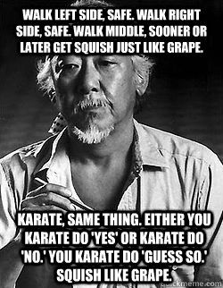

# Coding

* [Articles, Speeches, Papers, Books](#general)
* [Discipline](#discipline)

## Articles, Speeches, Papers, Books 

* [The Humble Programmer by Dijkstra](#humbleprogrammer)
* [Zed Shaw: Learn Python the Hard Way](https://learnpythonthehardway.org/book/intro.html)

### The Humble Programmer 
[The Humble Programmer](https://www.cs.utexas.edu/users/EWD/ewd03xx/EWD340.PDF) by Dijkstra 

> he went on to explain quietly that automatic computers were here to stay, that we were just at the beginning and could not I be one fo the persons called to make programming a respectable discipline in the years to come?

> And in those days many a clever programmer derived an immense intellectual satisfaction from the cunning tricks by means of which he contrived to squeeze the impossible into the constraints of his equipment.

> a really competent programmer should be puzzle-mninded and very fond of clever tricks...programming was nothing more than optimizing the efficiency of the computational process, in one direction or the other

> Perhaps the most saddening thing now is that, even after all those years of frustrating experience, still so many people honestly believe that some law of nature tells us that machines have to be that way. They silence their doubts by observing how many of these machines have been sold, and derive from that observation the false sense of inspection, that line of defense has the same convincing strength as the argument that cigarette smoking must be healthy because so many people do it.

> LISP has jokingly been described as "the most intelligent way to misuse a computer". I think that description a great compliment because it tramsits the full flavour of liberation: it has assisted a number of our most gifted fellow humans in thinking previously impossible thoughts.

> I absolutely fail to see how we can keep our growing programs firmly within our intellectual grip when by its sheer baroqueness the programming language -- our basic tool, mind you!-- already escapes our intellectual control.

> If you want more effective programmers, you will discover that they should not waste their time debugging, they should not introduce the bugs to start with. In other words: both goals point to the same change.

> We must not forget that it is not our business to make programs, it is our business to design classes of computations that will display a desired behavior.

> program testing can be a very effective way to show the presence of bugs, but it is hopelessly inadequate for showing their absence. The only effective way to raise the confidence level of a program significantly is to give a convincing proof of its correctness.

> the programmer should let correctness proof and program grow hand in hand

> the purpose of abstracting is not to be vague, but to create a new semantic level in which one can be absolutely precise

> The best way to learn to live with our limitations is to know them. 

> In a society in which the educational system is used as an instrument for the establishment of homogenized culture, in which the cream is prevented from rising to the top, the education of competent programmers could be politically implatable.

> We shall do a much better programming job, provided that we approach the task with a full appreciation of its tremendous difficulty, provided that we stick to modest and elegant programming languages, provided that we respect the intrinsic limitations of the human mind and approach the task as Very Humble Programmers.

## Discipline 
Requires discipline. Many good programmers learn through school, but I'll explain why that's not the smartest approach.

> From Infinite Jest by David Foster Wallace (page 118) on the importance of repition when training to become good at tennis: "*Boys, what it is is I'll tell you it's repition. First last always...it's repetitive movements and motions for their own sake, over and over until the accretive weight of the reps sinks the movements themselves down under your like consciousness into the more nether regions, the C.P.S. The machine-language...Until you can do it without thnking about it, play. At like fourteen, give and take, they figure here. Just do it. Forget about is there a point, of course there's no point. The point of reptition is there is no point. **Wait until it soaks into the hardware and then see the way this frees up your head**. A whole shitload of head-space you don't need for the mechanics anymore, after they've sunk in. Now the mechanics are wired in. Hardwired in. This frees up the head in the remarkablest ways. Just wait. You start thinking a whole different way now, playing. The court might as well be inside you. The ball stops being the ball. The ball starts being something that you just know ought to be in the air, spinning.*" This quote applies to more than just tennis.

> 