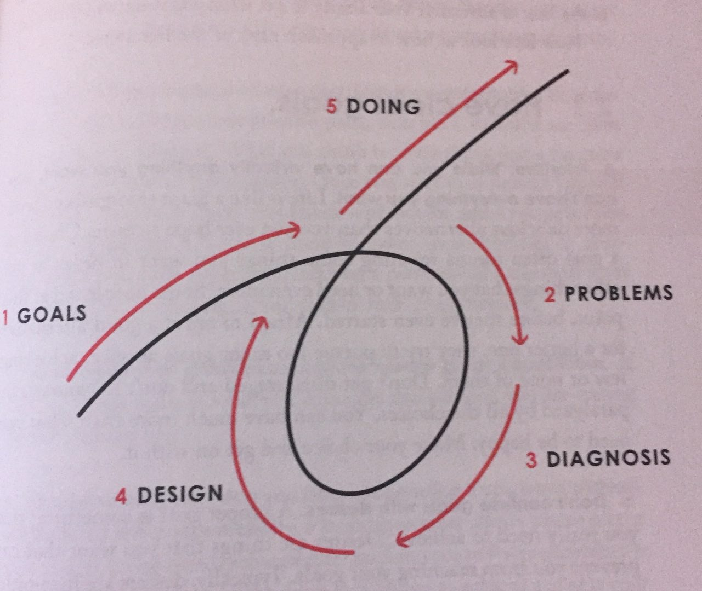

# Principles
> motivated by Ray Dalio's [Principles](https://www.principles.com/)

<!-- integrate my own experiences into this and change the wording to make it *mine* -->

* Growth Comes from Failure
* Radical Open Mindedness
* Valuing Thoughtful Disagreement
* Neocortex >>> Amygdala
* 2nd and 3rd order >>> 1st order

# Radical Open Mindedness

- Learning is the product of a continuous real-time feedback loop in which we make decisions, see their outcomes, and improve our understanding of reality as a result. Being radically open-minded enhances the efficiency of those feedback loops, because it makes what you are doing, and why, so clear to yourself and others that there can't be any misunderstandings.
- **Don't get hung up on your views of how things "should" be because you will miss out on learning how they really are.** 
- **Take ownership of consequences**: don't blame bad outcomes on anyone but yourself.
- **Sincerely believe that you might not know the best possible path and recognize that your ability to deal well with "not knowing" is more important than whatever it is you do know.**
- **If a number of different believable people say you are doing something wrong and you are the only one who doesn't see it that way, assume you are probably biased.** While it is possible you're right and they're wrong, you should switch from a fighting mode to an "asking questions" mode, compare your believability with theirs, and if necessary agree to bring in a neutral party you all respect to break the deadlock.

## Perspective

- **Top Down AND Bottom Up**: seeing things from the top down is the best way to understand ourselves and the laws of reality within the context of overarching universal laws...By taking a bottom-up perspective that looks at each individual case, we can see how it lines up with our theories about the laws that we expect to govern it. When they line up, we're good.
- **Distinguish between you as the designer of your machine and you as a worker with your machine.** One of the hardest things for people to do is to objectively look down on themselves within their circumstances (ie, their machine) so that they can act as the machine's designer and manager. Most people remain stuck in the perspective of being a worker within the machine. If you can recognize the differences between those roles and that it is much more important that you are a good designer/manager of your life than a good worker in it, you will be on the right path.

# Pain + Reflection = Progress

- The challenges you face will test and strengthen you. **If you're not failing, you're not pushing your limits, and if you're not pushing your limits, you're not maximizing your potential.**
- **Embrace tough love.** In my own life, what I want to give to people, most importantly to people I love, is the power to deal with reality to get what they want. In pursuit of my goal to give them strength, I will often deny them what they "want" because that will give them the opportunity to struggle so that they can develop the strength to get what they want on their own.
- **Regularly use pain as your guide toward quality reflection.** Mental pain often comes from being too attached to an idea when a person or an event comes along to challenge it...You will probably feel your amygdala kicking in through a tightening in your head, tension in your body, or an emerging sense of annoyance, anger, or irritability. Note these feelings when they arise in you. By being aware of such signals of closed-mindedness, you can use them as cues to control your behavior and guide yourself towards open-mindedness. Doing this regularly will strengthen your ability to keep your "higher-level you" in control. The more you do it, the stronger you will become.

## Weigh 2nd and 3rd Order Consequences

The first-order consequences of exercise (pain and time spent) are commonly considered undesirable, while the second-order consequences (better health and more attractive appearance) are desirable. Similarly, food that tastes good is often bad for you and vice versa.

Quite often the first-order consequences are the temptations that cost us what we really want, and sometimes they are the barriers that stand in our way. It's almost as though nature sorts us by throwing us trick choices that have both types of consequences and penalizing those who make their decisionson the basis of the first-order consequences alone.

By contrast, people who choose what they really want, and avoid the temptations and get over the pains that drive them away from what they really want, are much more likely to have successful lives. 

# 5-Step Process to Get What You Want Out of Life

1. Have clear goals
2. Identify and don't tolerate the problems that stand in the way of you achieving those goals.
3. Accurately diagnose the problems to get at their root causes.
4. Design plans that will get you around them.
5. Do what's necessary to push these designs through to results.

# Management

- **Write down your plan for everyone to see and to measure your progress against.** This includes all the granular details about who needs to do what tasks and when. The tasks, the narrative, and the goals are different, so don't mix them up. Remember, the tasks are what connect the narrative to your goals.
- Those who adapt do so by (a) teaching their brains to work in a way that doesn't come naturally (the creative person learns to become organized through discipline and practice, for instance), (b) using compensating mechanisms (such as programmed reminders), and/or (c) relying on the help of others who are strong where they are weak.
- **Get to know your blind spots.** When you are closed-minded and form an opinion in an area where you have a blind spot, it can be deadly. So take some time to record the circumstances in which you've consistently made bad decisions because you failed to see what others saw. Ask others -- especially those who've seen what you've missed -- to help you with this. Write a list, tack it up on the wall, and stare at it. If you ever find yourself about to make a decision (especially a big decision) in one of those areas without consulting others, understand that you're taking a big risk and that it would be illogical to expect that you'll get the results you think you will.

## Neocortex >>> Amygdala

Your deepest-seated needs and fears -- such as the need to be loved and the fear of losing love, the need to survive and the fear of not surviving, the need to be important and the fear of not mattering -- reside in primitive parts of your brain such as the amygdala, which are structures in your temporal lobe that process emotions. Because these areas of your brain are not accessible to your conscious awareness, it is virtually impossible for you to understand what they want and how they control you. They oversimplify things and react instinctively. They crave praise and respond to criticism as an attack, even when the higher-level parts of the brain understand that constructive criticism is good for you. They make you defensive, especially when it comes to the subject of how good you are. 

At the same time, higher-level consciousness resides in your neocortex, more specifically in the part called the prefontal cortex. This is the most distinctively human feature of your brain; relative to the rest of the brain, it's larger in humans than in most other species. This is hwere you experience the conscious awareness of decision making (the so-called "executive function"), as well as the application of logic and reasoning.

## Appreciate the Art of Thoughtful Disagreement
> *In thoughtful disagreement, your goal is not to convince the other party that you are right -- it is to find out which view is true and decide what to do about it.*

- To me, it's pointless when people get angry with each other when they disagree because most disagreements aren't threats as much as opportunities for learning
- You should be open-minded and assertive at the same time -- you should hold and explore conflicting possibilities in your mind while moving fluidly toward whatever is likely to be true based on what you learn. 
- To do this well, approach the conversation in a way that conveys that you're just trying to understand...Ask questions like "Would you rather I be open with my thoughts and questions or keep them to myself?"; "Are we going to try to convince each other that we a re right or are we going to open-mindedly hear each other's perspectives to try to figure out what's true and what to do about it?"; or "Are you arguing with me or seeking to understand my perspective?"

### Signs of Close-Mindedness

- Closed-minded people don't want their ideas challenged. 
- Closed-minded people are more likely to make statements than ask questions.
- Closed-minded people focus much more on being understood than on understanding others.
- Closed-minded people say things like "I could be wrong...but here's my opinion." It's often a perfunctory gesture that allows people to hold their own opinion while convicing themselves that they are being open-minded. If your statement starts with "I could be wrong" or "I'm not believable," you should probably follow it with a question and not an assertion.
- Closed-minded people block others from speaking.
- Closed-minded people have trouble holding two thoughts simultaneously in their minds.
- Closed-minded people lack a deep sense of humility.

# ORGANIZE LATER / RANDOM

I believe in **due process** and **checks and balances**. These ideas may seem abstract, but consider the way by which most people make decisions or come to conclusions. Instead of concluding something one way or another, I prefer to reserve judgement and keep an open mind until I have all the facts. Even then, I consider the possibility that I am wrong. This is what I mean by *due process*. *Checks and balances* in this context refers to my preference to get a diversity of opinions before making a decision or coming to a conclusion. These opinions are weighted according to believability (which should be established based on historical *data*).
