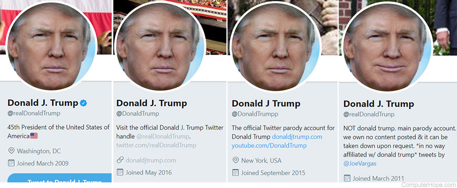

# Permissionless Liberal Radicalism

* [Motivation](#motivaion)
* [Sybil Attacks](#sybil)
* [User Onboarding](#user)
* [Zero Knowledge](#zkproof)

## Motivation <a name="motivation"></a>
[Liberal Radicalism](https://papers.ssrn.com/sol3/papers.cfm?abstract_id=3243656) by Vitalik Buterin, Zoe Hitzig, and E. Glen Weyl proposes a protocol for matching public funding according to the number of participants. The basic idea is that projects that are supported by a larger number of individuals is more beneficial for the community and, therefore, these projects should be given more capital than projects with little funding and/or only a few large donors. To optimize the allocation of funding (in a similar manner as [Quadratic Voting](http://ericposner.com/quadratic-voting/)), *the allocation of public funding is set to be proportional to the square of the sum of the square roots of contributions directed towards the public good*.

Even though the authors provide a novel solution for optimizing the allocation of public funds, their solution **assumes that the protocol can establish identity**, which is a huge limitation for applications on permissionless networks. Indeed, *permissionless* is usually indicative of an environment in which participants are free to join/leave the pool of *[keepers](https://medium.com/@rzurrer/keepers-workers-that-maintain-blockchain-networks-a40182615b66)* without linking their identity. However, modern cryptography may allow us to engineer an anti-sybil mechanism for permissionless crowdfunding networks. 

## Sybil Attacks <a name="sybil"></a>
Before we proceed, I want to be clear why [Liberal Radicalism](https://papers.ssrn.com/sol3/papers.cfm?abstract_id=3243656) makes the assumption that we can establish identity. When we establish identity, it is immediately clear how many people have participated in the crowdfunding scheme. The main idea behind Liberal Radicalism is to use the number of donors to guide the matching of public funds to private contributions. In this manner, the protocol described by Vitalik gives disproportionately more public funding to projects that have more individual supporters. However, blockchain applications are designed to be permissionless. Donors may not want to disclose their identity for personal reasons, and they deserve this right to privacy. Now it seems like we're in a bit of *quagmire*.


If we let anyone make user accounts, we ignore the obvious sybil attack vector in which anyone can make an infinite number of accounts. 



But, what if we weight each participant's vote according to how much of some cryptocurrency they stake? This solves the sybil attack vector in one sense (no additional benefit to creating fake accounts), but it still doesn't tell us how many individuals voted. We need to know how many individuals voted in order to allocate public funding accordingly. With this in mind, our two basic requirements for a decentralized crowdfunding mechanism are:
1. Identify the number of donors
2. Don't violate the privacy of donors by leaking or linking identity

This is a hard problem to solve. Let's take a stab at it.

## User onboarding <a name="user"></a>
Although there seems to be no clear fix at the protocol level, let's work backwards from the user to consider how we can work around this obstacle. A common user onboarding strategy for many "one time use" applications (like schedulers, todo lists, etc.) is to allow users to provide credentials for another centralized service in order to create an account. In safe implementations of this scheme, the application that employs this style of onboarding is never exposed to the 3rd party credentials of the participant (although some data about the account itself may be communicated). Regardless of how this is done for centralized login services, we can borrow this design pattern for a decentralized crowdfunding application in order to **ascertain the number of donors without revealing anything about their identity**. Still, we need to do better than most web apps and ensure that the user's credentials for the other service are kept safe and no information is communicated except for ```ACCEPTED``` or ```REJECTED```. Luckily we know of a certain tool in cryptography that enables us to prove something without revealing exactly what it is ;)

## Zero Knowledge Proofs <a name="zkproof"></a>
For the purposes of this example, we will rely on Github's authenticator to check credentials. The basic construction requires the user to submit a proof of user authenticity for Github (or whatever trusted 3rd party is being used). In the future, we hope to replace Github with a decentralized identity DApp, but we do not think it would be wise to get "*locked in*" to the development cycles of those projects (better to start building the pieces for this than to wait indefinitely until those teams have working products).

In terms of how to implement this, we can use the [Secure Remote Password (SRP)](https://en.wikipedia.org/wiki/Secure_Remote_Password_protocol) protocol. It's discussed briefly [here](https://crypto.stackexchange.com/a/26622). 